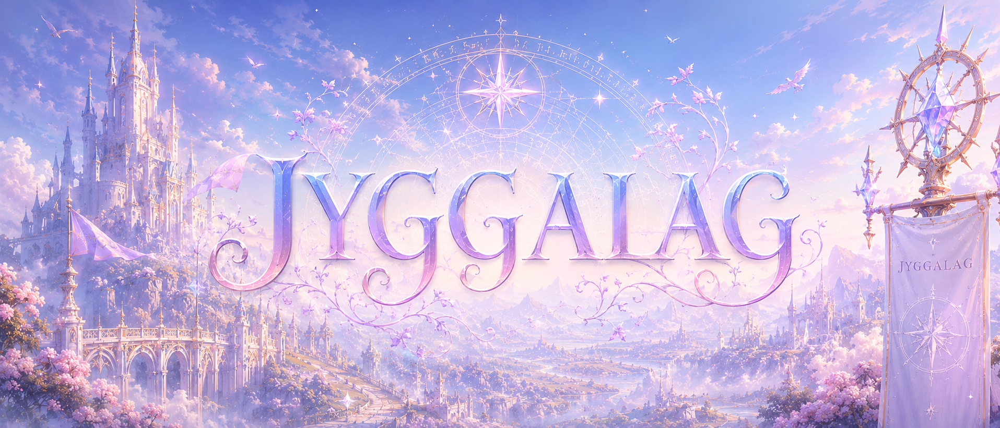

<picture>
  
</picture>

- - - - - - - - - - - - - - - - - - - - - - - - - - - - - - - - - - -

# 🏛️ Jyggalag

**Jyggalag** — десктопное приложение на Java/JavaFX, представляющее собой программу персонального учета рабочего
времени (планировщик задач).

- - - - - - - - - - - - - - - - - - - - - - - - - - - - - - - - - - -

> [!IMPORTANT]
>
> # ❗️ Дисклеймер / Disclaimer ❗ ️
> Проект является **учебной курсовой работой** и создан в демонстрационных и образовательных целях.
> Приложение представляет собой изолированную модель и не является коммерческим продуктом.

- - - - - - - - - - - - - - - - - - - - - - - - - - - - - - - - - - -

## ⚙️ Использование

1. Перейдите в раздел **Releases** и скачайте архив с актуальной версией.
2. Распакуйте в любую удобную папку.
3. Запустите `jyggalag.exe`.

### 🔮 Демонстрационный режим:

Для проверки работы интерфейса и логики без ручной регистрации используйте встроенные тестовые данные:

Логин: `test`

Пароль: `test`

- - - - - - - - - - - - - - - - - - - - - - - - - - - - - - - - - - -
*Подробная инструкция по запуску и техническая документация доступны в каталоге [`docs`](./docs)*

🔮 Лингвистический Апокриф: почему именно так?

Это конечно не [Ксарксес, Хермаеус и Огхма](https://github.com/EliG0/Xarxes), но на язык тоже ложится неудобно:

### 👑 Jyggalag ➔ Джиггалаг

* **По коду:** занимается организацией времени, задач и порядка в расписании пользователя.

* **По лору:**
  [Джигалаг](https://elderscrolls.fandom.com/ru/wiki/Джиггалаг) — [Даэдрический Принц](https://elderscrolls.fandom.com/ru/wiki/Князья_даэдра)
  порядка, настолько одержимый логикой и предсказуемостью, что его существование стало проблемой даже для других богов.
  В лоре сказано, что Джиггалаг достиг такого совершенства в порядке, что мог предсказать любое событие, исходя из
  логики и законов природы. В библиотеке содержались, таким образом, описания судеб всех существ как прошлого, так и
  будущего. Данное приложение, пока что, такими способностями не обладает. Но оно честно пытается хотя бы не дать
  пользователю забыть дедлайн.

* **По языку:** Латинское написание `Jyggalag` начинается с буквы **J**, которая в разных языках читается по-разному.
  Из-за этого название можно встретить в вариантах от «Йиггалаг» до «Джиггалаг». В русской
  локализации [TES](https://ru.wikipedia.org/wiki/The_Elder_Scrolls) закрепилось
  английское произношение через **«Дж»**, поэтому — **Джиггалаг**.

И в этом смысле название оказалось подозрительно подходящим.

В конце концов, любая система управления временем — это попытка навязать порядок чему-то принципиально хаотичному:
дедлайнам, встречам, курсовым работам и собственным фатальным решениям в три часа ночи.

🧀 Примечание для тех, кто дочитал до конца

В оригинальном лоре The Elder Scrolls история Джиггалага заканчивается не совсем благополучно.
У Принца Порядка действительно произошли
некоторые... [беды с башкой](https://elderscrolls.fandom.com/ru/wiki/Шеогорат#Общая_информация).

  

> Данная иллюстрация не несёт смысловой нагрузки и размещена здесь
> исключительно потому, что автор посчитал её слишком хорошей, чтобы не использовать.

